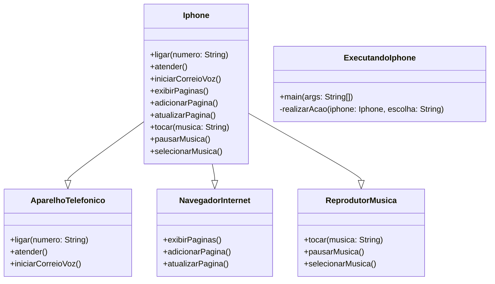

# Iphone_dio
criando uma interação de um iphone

## Diagrama de Classes

```mermaid
classDiagram
    class Iphone {
        +ligar(numero: String)
        +atender()
        +iniciarCorreioVoz()
        +exibirPaginas()
        +adicionarPagina()
        +atualizarPagina()
        +tocar(musica: String)
        +pausarMusica()
        +selecionarMusica()
    }
    class AparelhoTelefonico {
        +ligar(numero: String)
        +atender()
        +iniciarCorreioVoz()
    }
   class NavegadorInternet {
        +exibirPaginas()
        +adicionarPagina()
        +atualizarPagina()
    }
    class ReprodutorMusica {
        +tocar(musica: String)
        +pausarMusica()
        +selecionarMusica()
    }
    class ExecutandoIphone {
        +main(args: String[])
        -realizarAcao(iphone: Iphone, escolha: String)
    }
    Iphone --|> AparelhoTelefonico
    Iphone --|> NavegadorInternet
    Iphone --|> ReprodutorMusica

```
